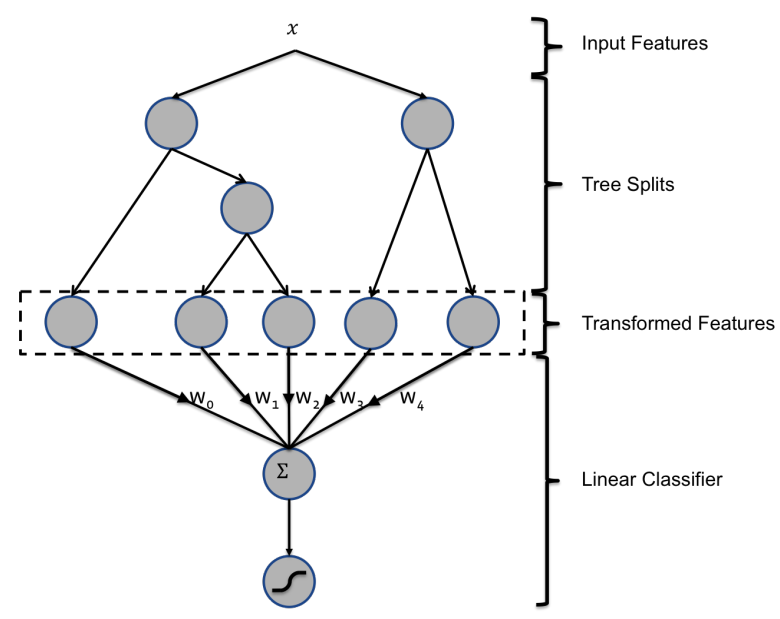
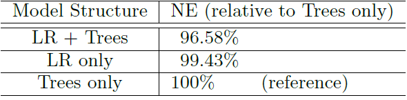
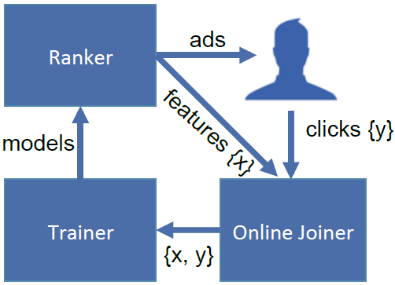

# GBDT+LR预测CTR经典论文阅读笔记

本文要介绍的CTR预估方法来自Facebook发表于2014年的一篇文章（[Practical Lessons from Predicting Clicks on Ads at Facebook](https://dl.acm.org/doi/pdf/10.1145/2648584.2648589)）。这篇文章通过GBDT+LR的组合方式，相比于其中任意单一方法，带来了CTR预估性能的提升。有关LR、GBDT的介绍可以参考之前的文章（[逻辑回归简介及实现](https://zhuanlan.zhihu.com/p/130209974)、[梯度提升树（GBDT）简介](https://zhuanlan.zhihu.com/p/139381538)）。其实有关这篇经典论文的专业解读已经很多了，我作为小白把自己的阅读笔记整理在这里只是为了加深理解，如果有写的不对的地方，还请大家指出，不胜感谢！

## 论文立意

这篇文章采用了GBDT+LR的组合结构，需要说明的是这两部分模型是分开训练的，也就是先训练好GBDT为每个数据构造新的特征，然后根据新特征来训练LR的。

首先关于使用GBDT这部分，给我的感觉来说，是为了添加一部分LR考虑不到的特征，因为如果单纯使用LR模型，只会考虑到每个特征本身对结果的影响，也就是所有特征的线性加权组合，但是如果使用GBDT构造出一部分特征的规则，就会使得LR考虑到特征之间的关系，虽然论文内容里给出的是单纯使用GBDT构造的特征来进行学习，但我们同样的可以利用数据的原有特征再加上GBDT特征共同预测CTR。

其次关于LR这部分，因为Facebook每天会产生特别多的新数据，GBDT是无法快速进行online learning的，因为数据量大，每次训练GBDT可能要花费几天的时间，但是LR是可以通过学习新数据来调整权重的，比如采用随机梯度下降的方法学习新的样本。所以GBDT可以采用每隔几天训练一次，但是LR采用实时更新的方式来预测CTR。

## 模型结构

这篇文章最大的改进点在于利用GBDT方法为每个样本构造了一系列特征，之后利用LR方法对特征加权求和，进而预估CTR。其模型结构如下图所示：

由于数据对应的类标为$y\in\{+1,-1\}$，分别代表该广告被点击和不被点击，因此GBDT在这篇论文中采用的是二分类问题的GBDT方法，在训练好GBDT模型之后，我们需要将每个样本$x$走一遍GBDT流程。如上图所示，GBDT构造了两棵决策树，分别有3个叶结点和2个叶结点，当样本输入到第一棵决策树时，我们假设其最终走到了第2个叶结点，接着输入到第二棵决策树时，我们假设其走到了第1个叶结点。

那么GBDT对这个样本$x$构造的新特征向量可以表示为：$\{0,1,0,1,0\}$。特征维度为5是因为GBDT共有5个叶结点，特征向量前3个值$\{0,1,0\}$代表样本在第1棵决策树上落入到了第2个叶结点，后两个值$\{1,0\}$代表样本在第2棵决策树上落入了第1个叶结点。因此我们知道，特征向量中1的个数代表了决策树的总棵数，而对于每个决策树来说，其相应的特征向量只有一个为1，其余均为0。

同样的，对每个样本$x$都经过相同的流程获取新的5维特征向量，在这之后，利用转换过特征之后的样本来训练LR模型。上图中的$\{w_{0},w_{1},w_{2},w_{3},w_{4}\}$代表的是LR模型中对每个特征的权重，我们知道每个样本会从根节点出发一直走到叶结点，这样来说样本走过的每条路径代表的都是一个特征规则，所以新特征向量中的$0,1$代表的是样本是否符合对应的规则路径，而LR的权重向量就是在学习每条规则对CTR结果的影响。

如下表所示，GBDT+LR的模型结构相较于单一GBDT或单一LR模型来说，其性能均有提升。表格中的评价指标NE（Normalized Entropy）可以理解为模型预测产生的损失与数据集原有损失之比，也就是说其值越小越好。相对于仅使用GBDT模型而言，GBDT+LR的方式将性能提升了3.4%，需要说明的是其中“LR only”方法是仅使用原有数据特征来预测CTR。

## 在线学习

这篇论文的后续部分讨论了很多有关在线学习（online learning）的东西，因为这个模型会部署在实际的互联网环境中，每天会遇到很多新的数据，而这些新数据会不断的改变训练样本的数据分布，进而影响模型的性能。

为了探究新数据对模型性能的影响，论文利用某一天的数据进行训练，并观察模型在接下来连续几天的表现，其结果如上图所示。从图中结果可以发现，在不更新模型的前提下，随着新数据的进入，模型的性能逐渐下降。GBDT+LR和仅使用GBDT这两种模型的性能在一周之后大概都下降了1%。

为了保持模型的性能，我们需要对模型进行实时更新。当遇到数百万的数据时，单机往往需要花费1天或者更多的时间来训练GBDT，因此，作者表明可以采取替代方案，也就是每天或者每隔几天训练GBDT，但是LR却可以通过随机梯度下降做到实时更新。

如上图所示的模型架构中，“Online Joiner”负责收集用户点击的实时信息，将收集到的数据传给“Trainer”模块，“Trainer”根据新数据训练将训练的models传给“Ranker”，“Ranker”负责给用户投递广告。还需要说明的是，因为系统只能收到用户的点击信息，对于如何认定用户没有点击广告，可以通过调整系统的等待时间来做到，比如用户没有在固定的一段时间内点击该广告，系统便认为用户没有点击，当然这个等待时间需要根据实际情况来调节。

论文还提到可以添加一个异常检测机制来得到比较稳定的模型，比如当有机器人恶意点击时，会产生大量虚假的数据进而使得数据集分布短时间内产生急剧变化，这个时候可以切断“Online Joiner”和“Trainer”的联系，来保证模型的稳定。

## 论文的其他部分

论文的第五章讨论了GBDT的规模对模型性能的影响，毕竟GBDT决策树越多的话，样本走一遍的时间会加长，导致模型预测时间变长。论文在所用的数据集上发现GBDT决策树棵数为500棵时，模型性能是最优的。作者还将GBDT所用到的特征划分为历史特征（historical features）、上下文特征（contextual features）两类，即一类是关于用户历史点击率的特征，另一类是用户所在环境的特征，作者通过实验探究了这两类特征对模型的重要性。

论文的第六章讨论了应对海量数据的处理方法。比如使用均匀下采样（Uniform subsampling）的方式减少模型的训练量，使用负采样（Negative down sampling）的方法平衡训练数据集类别分布（当然这之后需要校正得到真正的CTR预测值）。

## 小结

GBDT+LR确实提供了一个构造特征的新思路，因为单独使用LR模型的话，往往需要人为构造很多特征，这就要对数据集十分了解。但是GBDT+LR具体的使用效果，还是需要后续遇到业务问题时亲身实践才知道，具体情况还是会不一样的。